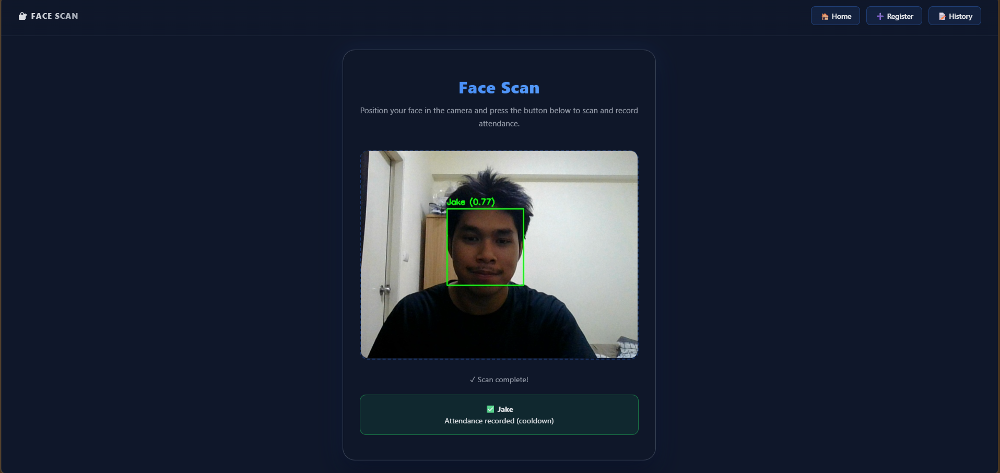
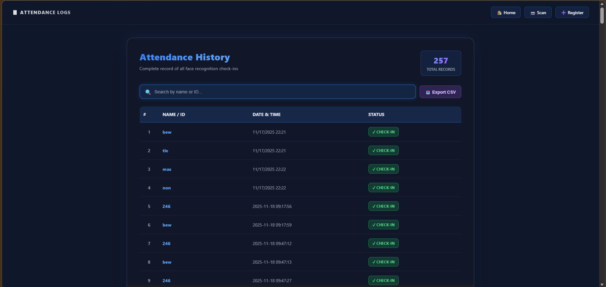

## 📸 Face Recognition Attendance System


> **A smart, contactless attendance management system leveraging Deep Learning technology for real-time identification.**

This project automates the attendance tracking process using a webcam. Built with **Python** and **Flask**, it integrates state-of-the-art Computer Vision models (**MTCNN** & **FaceNet**) to detect faces, verify identities, and automatically log entry times into an Excel/CSV file.

## ⚙️ System Architecture

The system operates through a specialized pipeline to ensure accurate recognition:

1.  **Image Capture:** The webcam captures live video frames via the Flask client.
2.  **Face Detection (MTCNN):** Locates faces within the frame with high accuracy.
3.  **Feature Extraction (FaceNet):** Converts the detected face into a 128-dimensional embedding vector.
4.  **Matching:** Compares the live embedding against the database using Euclidean distance to verify identity.
5.  **Logging:** Successfully identified users are logged with a timestamp into `attendance.csv`.

## 🛠️ Tech Stack & Tools

| Category | Technologies |
| :--- | :--- |
| **Languages** | Python 3.10+, JavaScript, HTML5, CSS3 |
| **AI & Vision** | **OpenCV** (Image processing), **MTCNN** (Detection), **FaceNet/InceptionResnetV1** (Recognition), **NumPy** |
| **Web & Data** | **Flask** (Backend Framework), **Pandas** (Data Management & Export) |

## ✨ Key Features

* **Real-time Recognition:** Instantly identifies registered users via live video feed.
* **Anti-Spoofing (Basic):** Algorithm implemented to distinguish between real faces and static photos.
* **Automated Logging:** Saves "Time-In", "Name", and "Date" automatically without manual input.
* **Dashboard UI:** A user-friendly web interface to view the camera feed and attendance status.

## 📸 Screenshots

<p align="center">
  
  
  
  
</p>


## 🚀 Installation & Usage

1.  **Clone the Repository**
    ```bash
    git clone https://github.com/WuttikornFunk/Face-Recognition-Attendance.git
    cd Face-Recognition-Attendance
    ```

2.  **Install Dependencies**
    ```bash
    pip install -r requirements.txt
    ```

3.  **Run the Application**
    ```bash
    python app.py
    ```
    * The application will start at: `http://127.0.0.1:5000`
    * Open your web browser and navigate to the URL to start the system.

---
